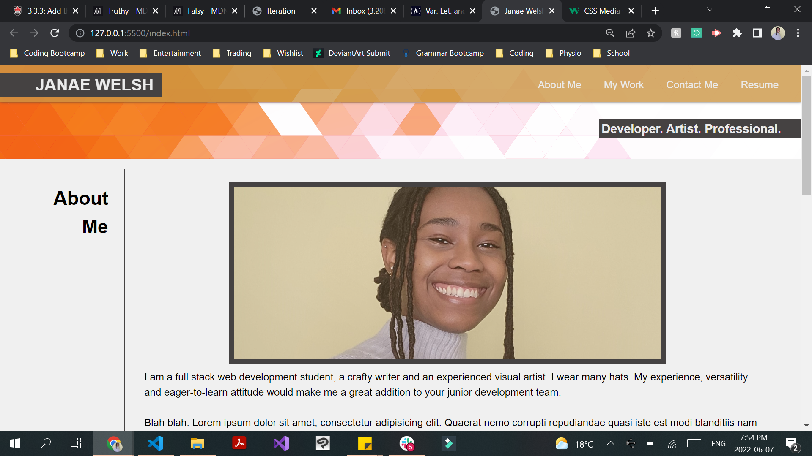

# sample-portfolio

Carleton Coding Bootcamp: Week 2 project (no source code provided).

##Main Objective

To create match the mock up layout provided and create a responsive website layout using CSS flexbox and media queries
